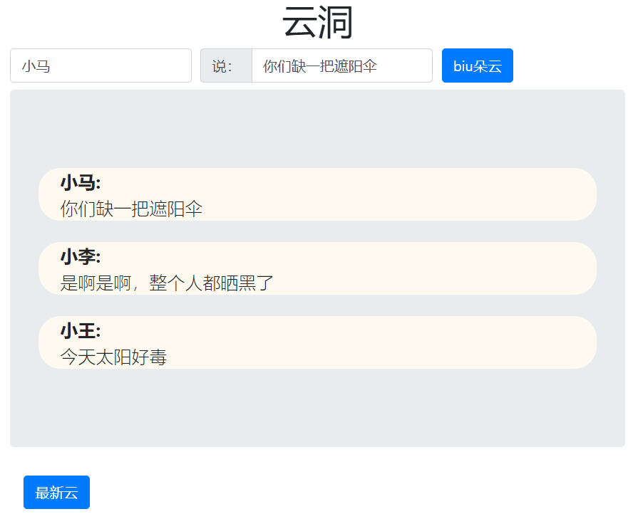

# 云洞

## 前言

本项目fork自：https://github.com/second-state/ssvm-nodejs-starter

看好rust！！！项目组加油

## 项目效果




## 做了什么？

类似树洞，取名云洞。

其实就是个简陋的留言板。

任何人都能在上边留言，都能看到他人的留言，也都能看到他人的留言。

留言日清，昨日不可见，恍若云朵，飘然而去，不留痕迹。

## 用了什么？

语言类：rust、js、html、css

环境：docker、centos、vscode

为了获取时间而引入模块：chrono

## 怎么做的？

从rust开始。

写了两个函数。

一个读取文件，将文件内容传出。

另一个写文件和创建文件，添加今日留言并且把文件内容传出。

js负责接值、解值和展示数据。

## 最难的是什么？

首先是环境。

由于网络环境不好，包的下载一直是个大难题。甚至docker都很难下载。

期间经历了docker到ubuntu再到docker的心酸变化。

其次是rust的语法。

rust和其他语言太不一样。够简洁，也够晦涩，需要消耗专门的心力去学习语法糖，才能使用这门语言。

## 收获？

首先是rust的知识。这是一种迥然不同的语言。

其次是js的强化。以及如何在各种各样稀奇古怪的环境中安装自己想要的软件。甚至我还装了两次ubuntu，均以环境搭建失败告终。根据错误报告，感觉和文件权限有关系。

最后是对wasm和ssvm的了解。稍微看了下它的代码，前端大杀器！期待它在web中的精彩表现。

## 如何运行本项目？

感觉官方教程来即可，推荐docker！

```
$ docker pull secondstate/ssvm-nodejs-starter:v1
$ docker run -p 3006:3006 --rm -it -v $(pwd):/app secondstate/ssvm-nodejs-starter:v1
(docker) # cd /app
(docker) # ssvmup build
(docker) # node node/server.js
```

浏览器打开：http://localhost:3006

## 排坑

### 1. 卡在ssvmup build

这个命令会做两件事。rust编译和js关联包的构建。

得先看看卡在哪一步。

首先，在项目目录下，执行`cargo update`。如果index更新很慢，说明卡在rust源下载。建议换源。编辑/usr/local/cargo/config文件，根据自身情况换合适的源。

假如更新成功，说明卡在js关联包的构建。请去手动下载 [wasm-bindgen](https://github.com/second-state/wasm-bindgen/releases/download/0.2.61%2Bssvm.15/wasm-bindgen-0.2.61+ssvm.15-x86_64-unknown-linux-gnu.tar.gz) 和 [binary](https://github.com/WebAssembly/binaryen/releases/download/version_91/binaryen-version_91-x86_64-linux.tar.gz)，并且把解压后的执行文件移入`/usr/local/bin`目录下。

### 2. docker镜像拉不下来

换源、指定源地址下载。

### 3. 自己安装环境

推荐ubuntu20。其他linux的动态库太老，容易报错。